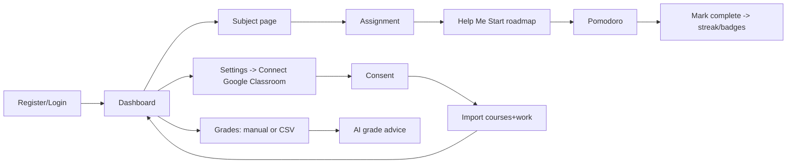

# ohneflow: Architecture Plan

## 1. Overview
Single Next.js 14+ (App Router, TypeScript) app: UI + REST route handlers in one repo.
PostgreSQL via Prisma. Auth via NextAuth (Credentials, JWT sessions). Tailwind for UI.
Deploy: GitHub -> Vercel (CI on every push) + Neon/Supabase Postgres. GitHub Pages cannot host this (needs a server).

Layers: `app/` (routes, UI) -> `server/services` (business logic) -> `server/repos` (Prisma, always scoped by userId) -> Postgres.
Integrations and AI sit behind interfaces in `server/integrations` and `server/ai`.

## 2. Folder structure
```
ohneflow/
  prisma/ schema.prisma, seed.ts
  src/
    app/
      (auth)/login, register
      (app)/dashboard, assignments, subjects/[id], calendar, grades,
            analytics, notes, study, settings, integrations
      api/ auth, users, subjects, assignments, notes, reminders, grades,
           analytics, ai, integrations/google, integrations/jupiter,
           notifications, cron/reminders
    components/ ui/, charts/, calendar/, ai/, layout/
    server/
      auth/ options.ts, (hashing lives in auth routes)
      services/ assignments, subjects, analytics, streaks, badges, reminders
      integrations/ google/ (oauth, client, sync), jupiter/ (adapter, manual)
      ai/ provider.ts, prompts.ts, context.ts, roadmap.ts
      security/ ratelimit.ts, crypto.ts, sanitize.ts, validation (zod schemas)
    lib/ db.ts, env.ts (zod-validated env), utils
    middleware.ts   (auth gate, security headers)
  docs/ ARCHITECTURE.md
  .env.example, README.md
```

## 3. Data model
See `prisma/schema.prisma`. Key rules: every user-owned row has `userId`; subjects and assignments
store `source` + `externalId` (unique per user) so Classroom syncs upsert instead of duplicating;
grades have `source` so JupiterEd rows can be added later with no migration of existing data.

## 4. API specification (all JSON, all zod-validated, all require session unless noted)
| Area | Endpoints |
|---|---|
| Auth | POST /api/auth/register (public, rate-limited), NextAuth at /api/auth/* |
| Users | GET/PATCH /api/users/me, DELETE /api/users/me |
| Subjects | GET/POST /api/subjects, GET/PATCH/DELETE /api/subjects/:id, GET /api/subjects/:id/stats |
| Assignments | GET (filter: subject, status, due range; sort) /POST /api/assignments, GET/PATCH/DELETE /:id, POST /:id/attachments |
| Notes | GET (search, subject, pinned)/POST /api/notes, PATCH/DELETE /:id |
| Reminders | GET/POST /api/reminders, DELETE /:id; GET /api/cron/reminders (CRON_SECRET) |
| Grades | GET/POST /api/grades, PATCH/DELETE /:id, GET /api/grades/gpa |
| Analytics | GET /api/analytics/{overview,productivity,workload,grades,forecast} |
| AI | POST /api/ai/chat (subjectId optional, streams), POST /api/ai/assignments/:id/roadmap, POST /api/ai/grades/advice |
| Google | GET /api/integrations/google/connect, GET /callback, POST /sync, DELETE / (disconnect), GET /status |
| Jupiter | GET /api/integrations/jupiter/status (reports "manual mode"), POST /import (CSV) |
| Notifications | GET /api/notifications, POST /:id/read, POST /read-all |

## 5. Security
- Passwords: bcrypt (cost 12, pure JS so it deploys cleanly on Vercel). Sessions: httpOnly, secure, sameSite JWT cookies.
- Every query filtered by session userId (prevents IDOR); ADMIN role gates any admin routes.
- Zod validation on all inputs; Prisma parameterized queries (no raw SQL); markdown sanitized (rehype-sanitize) so no XSS; CSP + security headers in middleware.
- Rate limits: auth (5/min/IP), AI (20/min/user), general API (100/min/user) via Upstash.
- OAuth tokens encrypted at rest (AES-256-GCM). Env validated at boot. Uploads: type/size allow-list, private storage with signed URLs.
- AI: server-side key only; system prompt enforces tutoring (hints, steps, explanations) rather than writing graded work.

## 6. Integrations
**Google Classroom:** OAuth 2.0 with incremental, read-only scopes (courses, coursework, student submissions)
and a consent screen in-app explaining what is read. Sync: courses -> Subjects (upsert by courseId, rename follows
Classroom), courseWork -> Assignments (upsert by id, due date mapped, status from submission state).
Manual "Sync now" + daily cron. Disconnect revokes the token and deletes the connection; imported data stays.
**JupiterEd:** no public API is documented, and scraping logins would likely violate its terms and student privacy rules.
Ship a `GradeProvider` interface with `ManualProvider` (and CSV import) now; `JupiterProvider` stays behind
`JUPITER_ENABLED` and is only implemented if Jupiter offers an official API or written approval.

## 7. AI design
`context.ts` builds a compact context (current subject, its open assignments and deadlines, recent grades) injected
into each request, so "Where should I start?" in Chemistry yields a Chemistry-specific plan.
"Help Me Start" returns structured JSON (steps, first actions, estimated minutes, timeline) cached in `AiRoadmap`.

## 8. User flows


## 9. Roadmap
1. Foundation: repo, env validation, Prisma, auth, layout, theming
2. Subjects + assignments CRUD, subject dashboards
3. Dashboard, calendar, reminders, notifications, email cron
4. AI assistant, Help Me Start, subject context
5. Google Classroom integration
6. Grades, GPA, analytics, charts
7. Pomodoro, streaks, badges, notes
8. Hardening: rate limits, CSP, tests, accessibility pass, README and deploy
